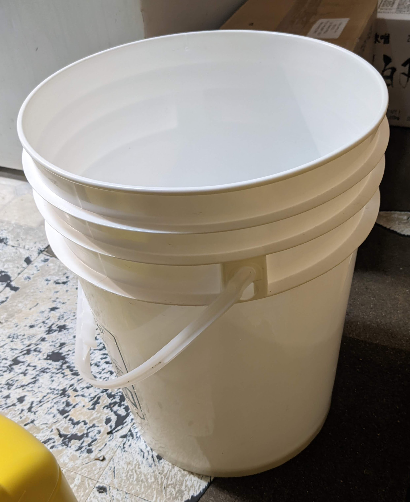
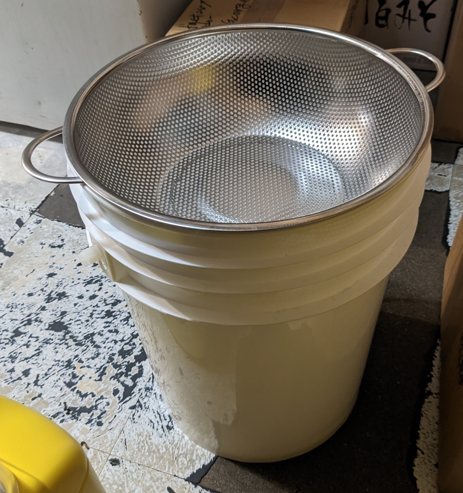

```{r setup, include=FALSE}
knitr::opts_chunk$set(echo = FALSE)
```

# Introduction
## Introduction
<!-- World -->
- One-third of food is lost or wasted around the world[1].

<!-- Canada -->
- Around 1.3 billion tons of FWL is generated annually, and the rate is projected to grow by 44% per year by 2025[2].
- Canada creates about 35 million tons and the largest waste generator per capita in western countries in 2016[3].

<!-- BC -->
- In BC, 40% of the waste to landfills is organic waste, the majority is produced from domestic waste[4].

<!-- PG -->


<!-- Domestic Studies -->


<!-- Food Service -->
- Limited number of studies have been conducted on the food supply side


## Introduction
### Research Questions

- What is the average volume of food that is wasted during processing and consumption in restaurants?
- What is the extent of food wastage in Japanese restaurants in Prince George?
- What are the main factors contributing to food loss and waste?
- To what extent is a social or environmental impact from food loss waste generated by a
single restaurant?
- What approaches are Japanese restaurant operators taking to reduce food waste generation?

<!-- ## Introduction -->
<!-- ### Significance -->
<!-- <!-- Sustainable society --> 
<!-- - Bullet 1 -->
<!-- <!-- Policy Implication -->
<!-- - Bullet 1 -->


# Literature Review
## Literature Review
### Definition of FLW
- No universally accepted definitions of FLW

| Organizations | Definition |
|---            |---         |
|Food Loss by FAO | harvest/slaughter/catch | retail/ consumption |
|Food Waste by FAO | retail/ consumption |
|Food Waste by EU | Food removed from FSC |
|Food Loss by US | unused product from agri |
|Food Waste by US | Subcomponent of FL |

## Literature Review
### Definition of FLW
| 1 | 2 | 3 | 4 | 5 |
|---|---|---|---|---|
| Production | Handling| Process | Distribution | Consumption|
|<--| FL |-->|<-- |FW -->|
|<--|--|FLW|--|-->|

| Organizations |FL|FW|Subset|
|---|---|---|---|
| FAO | First 3 stages | Last 2 stages| X |
| EU  | None| All | X |
| US  | All | Last 2 stages | O |


## Literature Review
### Five Measurements of FLW

| Method | Note |
|---     |---   |
|1.Self-report | individuals report FLW |
|              | low cost but high dropouts |
|2.Survey | collect FLW by interview or questionnaire |
|         | cost-effective but not accurate |
|3.Composition | sample and analysis at lab |
|              | need special knowledge and equipment |
|4.Mass balance | material flow analysis |
|               | limitation in waste factor assumptions |
|5.Direct weight | directly measure FLW |
|                | most accurate but high cost |

## Literature Review
### Statistic Model
- **Multiple Linear Regression**
- Ad: Simple and interpretable
- Disad: Not suitable to time series 
- Disad: Stationary and Spurious

- **Bayesian Modelling**
- Ad: Flexible and adaptable to time series data
- Disad: No appropriate result in some cases

## Literature Review
### Effects of Food Loss and Waste

- **Economic Loss**:
- labour, material resources, time, and energy
- **Environmental Impacts**:
- water scarcity, soil erosion, and GHG

## Literature Review
### Hypotheses

- Estimate average FLW
- Any patterns between FLW and business operations
- Any patterns between FLW and weather conditions
- 


# Methods
## Methods
### Study Area
- Japanese restaurant in Prince George
- lunch and dinner for three hours each, six days of a week

## Methods
### Sample Collection
{width=40%}
{width=45%}

## Methods
### Sample Size
- By Power analysis, 95% CI and 10% margin of error with most conservative estimate says 97 samples[]
- one in ten rule (rule-of-thumb) suggests 100 observations with 10 predictors[]
- Green's rule states 130 samples with 10 predictors[] 

## Methods
### Variables

| Variables | Note |
|---     |---   |
|1.Food Loss         | Daily disposed food by kitchen |
|2.Liquid Food Waste | Daily disposed liquid food by customers |
|3.Solid Food Waste  | Daily disposed solid food by customers |
|4.Number of Customers | Daily Number of dine-in customers |
|5.Sales | Daily sales |
|6.Liquor   | Daily Number of liquors sold |
|7.Takeouts | Daily Number of takeout sold |
|8.Orders   | Daily Number of orders sold |
|9.Temperature | Hourly mean temperature each day |
|10.Humidity   | Hourly mean humidity each day |
|11.Precipitation | Precipitation each day |

## Methods
### Multiple Linear Regression Model (additive)
$$
\begin{aligned}
Y_i &= \beta x_i + \epsilon_i\\
\epsilon_i &\overset{\text{i.i.d.}}{\sim} N(\mu=0, \sigma^2).
\end{aligned}
$$

### Baysian Modelling
$$
\begin{aligned}
Y_i &= \beta_i x_i + \epsilon_i\\
\beta_{i} &\sim N(\beta_{i-1}, \sigma_{\beta}^2)\\
\epsilon_i &\sim N(0, \sigma_{y}^2).
\end{aligned}
$$

# Expected Results
## Expected Results
### Expected Results

- Estimations of FLW in a restaurant
- Patterns of FLW
- Implications of FLW reduction 


## Expected Results
### Current Progress
- From Sept. 16, four months.
- Collected over 100 samples.
- Basic analysis (Histogram, Time series plots)

## Expected Results


### TODO
- Develop potential causes of FLW (weather)
- 
- 

# Acknowledgements
## Acknowledgements
I would like to express my gratitude to my supervisor, Dr. Balbinder Deo, and to the committee member for his support and encouragement in my initial thesis development. 
I would also like to thank the University of Northern British Columbia and Prince George for allowing me an opportunity to pursue graduate studies.


# References
## References
[1]
[2]
[3]
[4]
[5]
