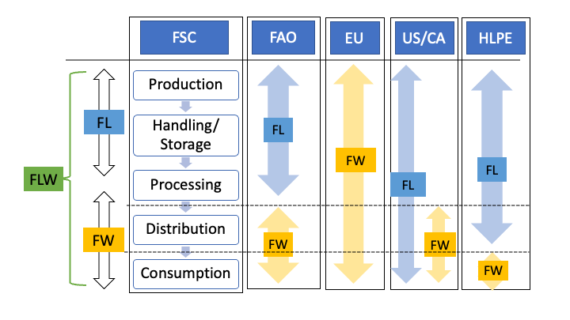
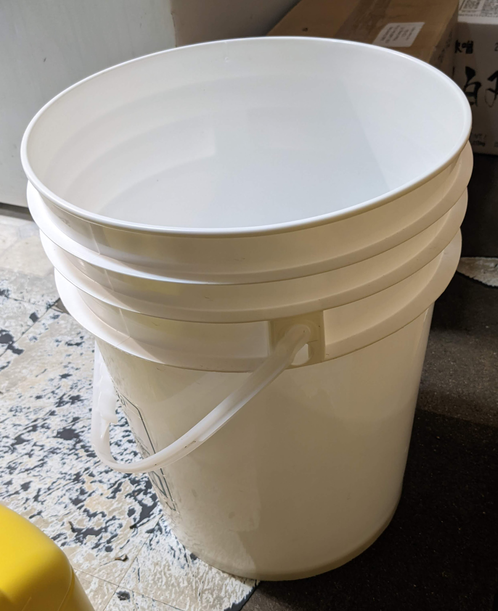

# Introduction
## Introduction
Food Loss and Waste (FLW) happens everywhere.

<!-- World -->
- One-third of food is lost or wasted around the world[1].
- Around 1.3 billion tons of FWL is generated annually, and the rate is projected to grow by 44% per year by 2025[2].

<!-- Canada -->
- Canada creates about 35 million tons and the largest waste generator per capita in western countries in 2016[3].
- Canada's avoidable FLW is 49.5 million CAD[4].

## Introduction
<!-- BC -->
- In BC, 40% of the waste to landfills is organic waste, the majority is produced from domestic waste[5].

<!-- Domestic Studies -->
- Recent huge discoveries in the food waste research focus on waste generated by households:[6,7,8,9].
<!-- (Aschemann-Witzel et al., 2015; Lusk & Ellison, 2017; Nahman et al., 2012; Von Massow et al., 2019). -->

<!-- Food Service -->
- Limited number of studies done on the food supply side.
- Even little esimations of FLW in food service industry. 

## Introduction
### Research Questions

- What is the average volume of food that is wasted during processing and consumption in restaurants?
- What is the extent of food wastage in Japanese restaurants in Prince George?
- What are the main factors contributing to food loss and waste?
- To what extent is a social or environmental impact from food loss waste generated by a
single restaurant?
- What approaches are Japanese restaurant operators taking to reduce food waste generation?

<!-- ## Introduction -->
<!-- ### Significance -->
<!-- <!-- Sustainable society --> 
<!-- - Bullet 1 -->
<!-- <!-- Policy Implication -->
<!-- - Bullet 1 -->

# Literature Review
## Literature Review
### Definition of FLW
- No universally accepted definitions of FLW

| Organizations | Definition |
|---            |---         |
|Food Loss by FAO | harvest/slaughter/catch | retail/ consumption |
|Food Waste by FAO | retail/ consumption |
|Food Waste by EU | Food removed from FSC |
|Food Loss by US | unused product from agri |
|Food Waste by US | Subcomponent of FL |
(Source [10])

## Literature Review
### Definition of FLW
| 1 | 2 | 3 | 4 | 5 |
|---|---|---|---|---|
| Production | Handling| Process | Distribution | Consumption|
|<---|---|FLW|---|--->|
|<---| FL |--->|<--- |FW --->|

| Organizations |FL|FW|Subset|
|---|---|---|---|
| FAO | First 3 stages | Last 2 stages| X |
| EU  | None| All | X |
| US  | All | Last 2 stages | O |

## Literature Review
### Definition of FLW
|      | Edible| Inedible|
|---   |---    |---      |
|Solid | FL | FW |
|Liquid| FW  | X |

## Literature Review
### Definition of FLW
- Food Loss: generated by provider
- Food Waste: generated by consumers

{width=90%}

## Literature Review
### Five Measurements of FLW

| Method | Note |
|---     |---   |
|1.Self-report | individuals report FLW |
|              | low cost but high dropouts |
|2.Survey | collect FLW by interview or questionnaire |
|         | cost-effective but not accurate |
|3.Composition | sample and analysis at lab |
|              | need special knowledge and equipment |
|4.Mass balance | material flow analysis |
|               | limitation in waste factor assumptions |
|5.**Direct weight** | directly measure FLW |
|                    | most accurate but high cost |

## Literature Review
### Statistic Model
- **Multiple Linear Regression**
- Ad: Simple and interpretable
- Disad: Not suitable to time series 
- Disad: Stationary and Spurious

- **Bayesian Modelling**
- Ad: Flexible and adaptable to time series data
- Disad: No appropriate result in some cases

## Literature Review
### Effects of Food Loss and Waste

- **Economic Loss**:
- labour, material resources, time, and energy

- **Environmental Impacts**:
- water pollution, deforestation, soil erosion, and GHG

Reducing FLW can mitigate these economic and environmental impacts. 
Through better supply chain management, reducing consumer food waste, and increasing food recovery.

## Literature Review
### Hypotheses

- Estimate average FLW
- Any patterns between FLW and business operations
- Any patterns between FLW and weather conditions
- Estimate economic and environmental impacts

# Methods
## Methods
### Study Area
- Japanese restaurant located a suburban area of Prince George
- lunch and dinner for three hours each
- six days of a week: from Tuesday to Sunday

{width=35%}

## Methods
### Sample Collection
Busket for Food Loss       |  Busket and Strainer for Food Waste
:-------------------------:|:-------------------------:
{width=30%}|  {width=35%}

## Methods
### Sample Size
- **Power analysis**, 95% CI and 20% margin of error with 10 explanatory variables says 110 samples.
<!-- pwr.f2.test(u=10, v=NULL, f2=0.15, sig.level=0.05, power=0.8) -->
- **Rule-of-thumb**, one in ten rule suggests 100 observations with 10 predictors[11]
- Green's rule states 130 samples with 10 predictors[12] 

## Methods
### Variables

| Variables | Note |
|---     |---   |
|1.Food Loss         | Daily disposed food by kitchen |
|2.Liquid Food Waste | Daily disposed liquid food by customers |
|3.Solid Food Waste  | Daily disposed solid food by customers |
|4.Number of Customers | Daily Number of dine-in customers |
|5.Sales | Daily sales |
|6.Liquor   | Daily Number of liquors sold |
|7.Takeouts | Daily Number of takeout sold |
|8.Orders   | Daily Number of orders sold |
|9.Temperature | Hourly mean temperature each day |
|10.Humidity   | Hourly mean humidity each day |
|11.Precipitation | Precipitation each day |

## Methods
### Multiple Linear Regression Model (additive)
$$
\begin{aligned}
Y &=  X\beta + \epsilon\\
\epsilon_i &\overset{\text{i.i.d.}}{\sim} N(\mu=0, \sigma^2).
\end{aligned}
$$

### Baysian Modelling
$$
\begin{aligned}
Y &= X\beta_i + \epsilon\\
\beta_{i} &\sim N(\beta_{i-1}, \sigma_{\beta}^2)\\
\epsilon_i &\sim N(0, \sigma_{y}^2).
\end{aligned}
$$

# Expected Results
## Expected Results
### Expected Results

- Estimations of FLW in a restaurant
- Patterns of FLW
- Implications of FLW reduction 

## Expected Results
### Current Progress
- From Sept. 16, four months.
- Collected over 100 samples.
- Basic analysis (Histogram, Time series plots)

 Food Waste per Week of Day| Food Loss and Waste Trend
:-------------------------:|:-------------------------:
{width=40%} |{width=40%}

## Expected Results
### TODO
- Develop potential causes of FLW (Weather and Calendar Effects)
- Calculate the average rate of food loss and waste
- Estimate econbomic and environmental effects

# Acknowledgements
## Acknowledgements
I would like to express my gratitude to my supervisor, Dr. Balbinder Deo, and to the committee member for his support and encouragement in my initial thesis development. 
I would also like to thank the University of Northern British Columbia and Prince George for allowing me an opportunity to pursue graduate studies.

# References
## References
[1] Gustavsson, J. (Ed.). (2011). Global food losses and food waste: extent, causes and prevention;
study conducted for the International Congress Save Food! at Interpack 2011, [16 - 17
May], Düsseldorf, Germany. Food and Agriculture Organization of the United Nations.\
[2] Blakeney, M. (2019). Food loss and food waste: Causes and solutions.\
[3] National Zero Waste Council. (2016). A tax incentive to prevent food waste in Canada. NZWC. Retrieved October 12, 2021, from http://www.nzwc.ca/Documents/NZWC- TaxIncentiveBackgrounder.pdf. 
\
[4] Gooch, M., Bucknell, D., LaPlain, D., Dent, B., Whitehead, P., Felfel, A., Nikkel, L., & Maguire, M. (2019). The avoidable crisis of food waste: Technical report. Value Chain Management International and Second Harvest, Ontario, Canada, 122.\

## References
[5] Retrieved on August 20, 2022 from: https://www2.gov.bc.ca/gov/content/environment/waste-management/food-and-organic-waste/prevent- food-waste\
[6] Aschemann-Witzel, J., de Hooge, I., Amani, P., Bech-Larsen, T., & Oostindjer, M. (2015). Consumer-related food waste: Causes and potential for action. Sustainability (Switzerland), 7(6), 6457–6477.\
[7] Lusk, J. L., & Ellison, B. (2017). A note on modelling household food waste behaviour. Applied Economics Letters, 24(16), 1199–1202.\
[8] Nahman, A., de Lange, W., Oelofse, S., & Godfrey, L. (2012). The costs of household food waste in South Africa. Waste Management, 32(11), 2147–2153.\

## References
[9] Von Massow, M., Parizeau, K., Gallant, M., Wickson, M., Haines, J., Ma, D. W. L., Wallace, A., Carroll, N., & Duncan, A. M. (2019). Valuing the multiple impacts of household food waste. Frontiers in Nutrition, 6, 143.\
[10] Ishangulyyev, R., Kim, S., & Lee, S. H. (2019). Understanding food loss and waste—why are we losing and wasting food?. Foods, 8(8), 297.\
[11] Harrell, F. E., Lee, K. L., Califf, R. M., Pryor, D. B., &amp; Rosati, R. A. (1984). Regression modelling strategies for improved prognostic prediction. Statistics in Medicine, 3(2), 143–152. https://doi.org/10.1002/sim.4780030207 \
[12] Green, S. B. (1991). How many subjects does it take to do a regression analysis. Multivariate behavioral research, 26(3), 499-510.\
